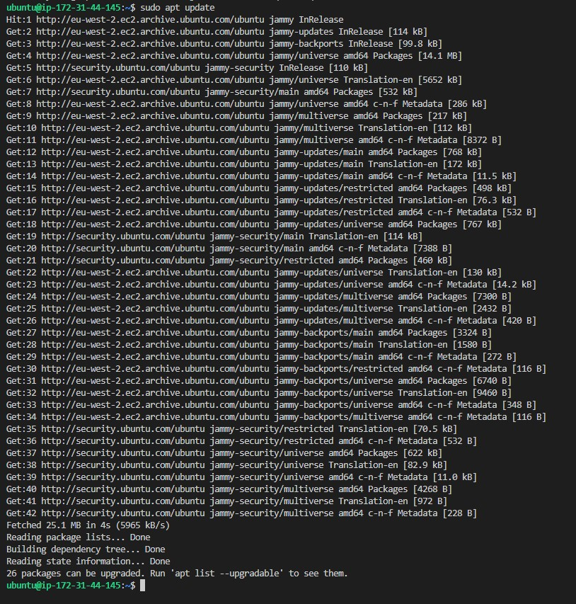
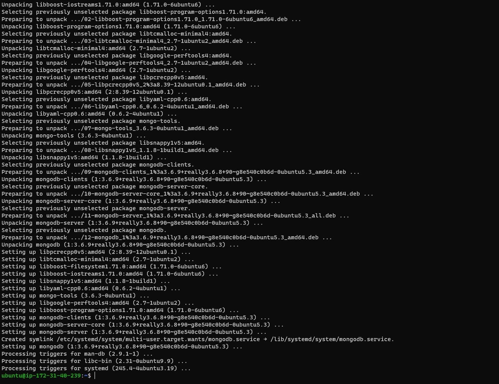

## MEAN STACK DEPLOYMENT TO UBUNTU IN AWS

## *Install Node Js*

To set up Express routes and Angular JS controllers, I installed Node.js. But before Node.js installation, I updated and upgraded my ubuntu server with the commands `sudo apt update` and `sudo apt upgrade` respectively. The images below displayed the outputs generated for the two actions respectively.




After the server had been updated and upgraded, I added certificates to the server by running commands `sudo apt -y install curl dirmngr apt-transport-https lsb-release ca-certificates` and `curl -sl https://deb.nodesource.com/setup_12.x | sudo -E bash -` and their outputs are displayed in the images below respectively


After the certificates had been added, I installed Nodejs with command `sudo apt install -y nodejs` and the output generated is displayed in the image below:


NOTE: There will be no need for me to install npm separately since the nodejs version. I installed contains npm installation. That is npm is being installed as I have installed nodejs. The version of the nodejs and npm installed are shown in the image below:


## *Install MongoDB*

To store JSON-like documents, I installed MongoDB which stores data in flexible because fields in a database can be different from one document to another and structure of data can as well be changed from time to time. In this application, I added book records to MongoDB that contains Book name, ISBN number, Author, and page numbers. 

Before installing MongoDB, I added gpg key by  running command:

`sudo apt-key adv --keyserver hkp://keyserver.ubuntu.com:80 --recv 0C49F3730359A14518585931BC711F9BA15703C6` and the output is displayed below:


After adding the key, I added mongodb list with command `echo "deb [ arch=amd64 ] https://repo.mongodb.org/apt/ubuntu trusty/mongodb-org/3.4 multiverse" | sudo tee /etc/apt/sources.list.d/mongodb-org-3.4.list` as displayed in the image below:


After the keys had been added, I installed mongodb by running command `sudo apt install -y mongodb` and the output is displayed in the image below:




I then started the service and then check the installation status with commands `sudo service mongodb start` and `sudo systemctl status mongodb` and the image are displayed below:


After the status had checked and everything seems okay, I installed body-parser package to help me to process the JSON files passed in request to the server by running the command `sudo npm install body-parser` and the output below was generated.


I therefore created a folder named Books with command `sudo mkdir` and opened the folder to initialize npm project by running command `npm init`. The output is displayed below:


After this has been done, I created a file named server.js with command `sudo touch server.js` and opened it with command `sudo vi server.js` and then wrote the scritp below into it:

```
var express = require('express');
var bodyParser = require('body-parser');
var app = express();
app.use(express.static(__dirname + '/public'));
app.use(bodyParser.json());
require('./apps/routes')(app);
app.set('port', 3300);
app.listen(app.get('port'), function() {
    console.log('Server up: http://localhost:' + app.get('port'));
});
```

## INSTALLING EXPRESS AND SETTING ROUTES TO THE SERVER

In order to provide features for the application, I installed Express which is a flexible Node.js web application framework. This will help to pass book information to and from the Mongodb database. 

Also, to provide a straight-forward, schema-based solution to model the application data, mongoose package will be installed. This will create a schema for the database to store data of the book register. 

To install Express with mongoose package I run command `sudo npm install express mongoose` and the output generated could be found below:


Then, I created another folder called apps and created a file named routes.js. The image below show all the commands ran.


In side the routes file, I wrote the script shown below:

```
var Book = require('./models/book');
module.exports = function(app) {
  app.get('/book', function(req, res) {
    Book.find({}, function(err, result) {
      if ( err ) throw err;
      res.json(result);
    });
  }); 
  app.post('/book', function(req, res) {
    var book = new Book( {
      name:req.body.name,
      isbn:req.body.isbn,
      author:req.body.author,
      pages:req.body.pages
    });
    book.save(function(err, result) {
      if ( err ) throw err;
      res.json( {
        message:"Successfully added book",
        book:result
      });
    });
  });
  app.delete("/book/:isbn", function(req, res) {
    Book.findOneAndRemove(req.query, function(err, result) {
      if ( err ) throw err;
      res.json( {
        message: "Successfully deleted the book",
        book: result
      });
    });
  });
  var path = require('path');
  app.get('*', function(req, res) {
    res.sendfile(path.join(__dirname + '/public', 'index.html'));
  });
};
```

Inside the app folder, I created another directory called models and then created a book.js file inside it. I opened the book.js file and wrote the script below into it:

```
var mongoose = require('mongoose');
var dbHost = 'mongodb://localhost:27017/test';
mongoose.connect(dbHost);
mongoose.connection;
mongoose.set('debug', true);
var bookSchema = mongoose.Schema( {
  name: String,
  isbn: {type: String, index: true},
  author: String,
  pages: Number
});
var Book = mongoose.model('Book', bookSchema);
module.exports = mongoose.model('Book', bookSchema);
```

## ACCESS THE ROUTES WITH ANGULARJS

To connect the web page with Express and perform actions on the book register, I created an access through AngularJS. To achieve this the following steps were taken:

I created a directory callled public inside the Books folder and then created a file called script.js and wrote the script below into it. 

```
var app = angular.module('myApp', []);
app.controller('myCtrl', function($scope, $http) {
  $http( {
    method: 'GET',
    url: '/book'
  }).then(function successCallback(response) {
    $scope.books = response.data;
  }, function errorCallback(response) {
    console.log('Error: ' + response);
  });
  $scope.del_book = function(book) {
    $http( {
      method: 'DELETE',
      url: '/book/:isbn',
      params: {'isbn': book.isbn}
    }).then(function successCallback(response) {
      console.log(response);
    }, function errorCallback(response) {
      console.log('Error: ' + response);
    });
  };
  $scope.add_book = function() {
    var body = '{ "name": "' + $scope.Name + 
    '", "isbn": "' + $scope.Isbn +
    '", "author": "' + $scope.Author + 
    '", "pages": "' + $scope.Pages + '" }';
    $http({
      method: 'POST',
      url: '/book',
      data: body
    }).then(function successCallback(response) {
      console.log(response);
    }, function errorCallback(response) {
      console.log('Error: ' + response);
    });
  };
});
```

In addition, I also created another file called index.html inside the public folder and wrote the script below into it.


```
<!doctype html>
<html ng-app="myApp" ng-controller="myCtrl">
  <head>
    <script src="https://ajax.googleapis.com/ajax/libs/angularjs/1.6.4/angular.min.js"></script>
    <script src="script.js"></script>
  </head>
  <body>
    <div>
      <table>
        <tr>
          <td>Name:</td>
          <td><input type="text" ng-model="Name"></td>
        </tr>
        <tr>
          <td>Isbn:</td>
          <td><input type="text" ng-model="Isbn"></td>
        </tr>
        <tr>
          <td>Author:</td>
          <td><input type="text" ng-model="Author"></td>
        </tr>
        <tr>
          <td>Pages:</td>
          <td><input type="number" ng-model="Pages"></td>
        </tr>
      </table>
      <button ng-click="add_book()">Add</button>
    </div>
    <hr>
    <div>
      <table>
        <tr>
          <th>Name</th>
          <th>Isbn</th>
          <th>Author</th>
          <th>Pages</th>

        </tr>
        <tr ng-repeat="book in books">
          <td>{{book.name}}</td>
          <td>{{book.isbn}}</td>
          <td>{{book.author}}</td>
          <td>{{book.pages}}</td>

          <td><input type="button" value="Delete" data-ng-click="del_book(book)"></td>
        </tr>
      </table>
    </div>
  </body>
</html>
```


